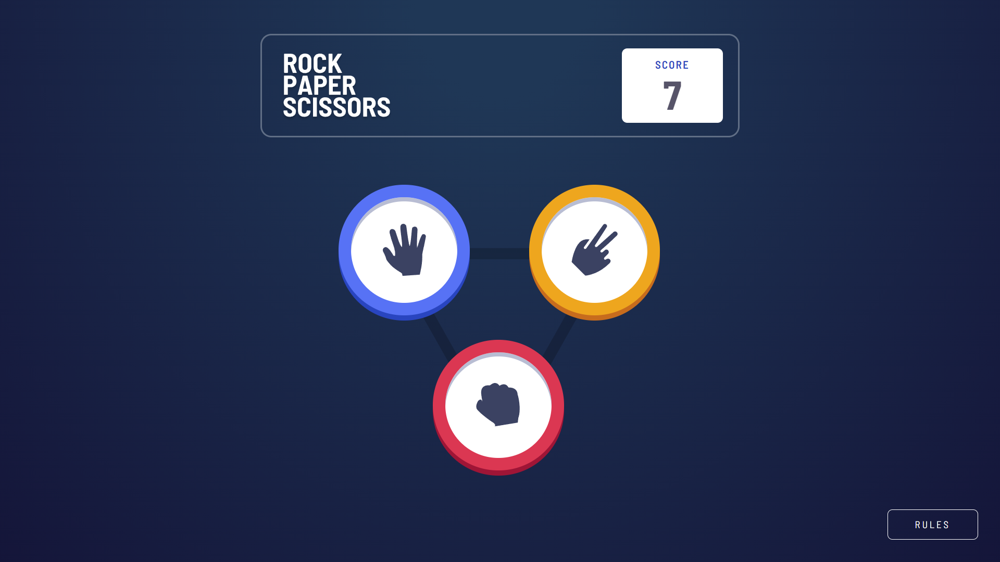

# Frontend Mentor - Rock, paper, scissors!

This is my solution to the [Rock, Paper, Scissors game challenge on Frontend Mentor](https://www.frontendmentor.io/challenges/rock-paper-scissors-game-pTgwgvgH/). Frontend Mentor challenges help you improve your coding skills by building realistic projects. 

## Table of contents

- [Overview](#overview)
  - [The challenge](#the-challenge)
  - [Screenshot](#screenshot)
  - [Links](#links)
- [My process](#my-process)
  - [Built with](#built-with)
  - [What I learned](#what-i-learned)
- [Author](#author)

### Screenshot

### Links

- Solution URL: [Frontend Mentor Solution]()
- Live Site URL: [Live Site](https://dundeea.github.io/Rock-Paper-Scissors/)
## My process

### Built with

- Semantic HTML5 markup
- Flexbox
- Jquery
- Responsive Design

### What I learned

 My biggest take away from this project was the experiance gained with Jquery. This is the first project I 
 have completed with the library. I already had prior experiance working with DOM manipulation using vanilla js which is an important skill to have, but Jquery is very usesful for doing the same amount with less lines of code.

## Author
- Github - [@DundeeA](https://github.com/DundeeA)
- Frontend Mentor - [@DundeeA](https://www.frontendmentor.io/profile/DundeeA)
